# VendingApp

The VendingApp application is an imitation of a real-life vending machines system connected to a database.
The user can: 
create and delete vending machines. 
Imitate the process of buying items from a vending machine.
Maintain a vending machine (top-up, cashing)
Database contains:
Vending machines info.
Sales info.
Stock quantity alarms.   

[View VendingApp on Heroku](https://vendingapp-8ebedfdd40cd.herokuapp.com/)

[View VendingMachine spreadsheet](https://docs.google.com/spreadsheets/d/1WgqyZJv61UsML8GGC8QygVm5rDc_4K5IeFve66Sfjp8/edit?usp=sharing)

[View VendingSales spreadsheet](https://docs.google.com/spreadsheets/d/1FbPbWOSGx6rh_AAkMYSMEWlBVr_n5EkIGA-fEFsz5J8/edit?usp=sharing)

[View Alarms spreadsheet](https://docs.google.com/spreadsheets/d/1JJfoOBQzP3t4PFv2pj6MkkTAolq6V9nA3o1Q2dzmgvU/edit?usp=sharing)

---

## CONTENTS

- [VendingApp](#VendingApp)
  - [**CONTENTS**](#contents)
  - [**User Experience (UX)**](#user-experience-ux)
    - [Initial Discussion](#initial-discussion)
    - [User Stories](#user-stories)
  - [**Features**](#Features)
    - [Existing Features](#Existing-Features)
    - [Future Features](#Future-Features)
  - [**Data Model**](#Data-Model)
  - [**Technologies Used**](#technologies-used)
    - [Languages Used](#languages-used)
    - [Frameworks, Libraries \& Programs Used](#frameworks-libraries--programs-used)
  - [**Deployment \& Local Development**](#deployment--local-development)
    - [Deployment](#deployment)
    - [Local Development](#local-development)
      - [How to Fork](#how-to-fork)
      - [How to Clone](#how-to-clone)
  - [**Testing**](#testing)
  - [**Credits**](#credits)
    - [Code Used](#code-used)
    - [ Acknowledgments](#acknowledgments)

---

## **User Experience (UX)**

 

### **Initial Discussion**
For the rest of the document, I'll be using vm instead of vending machine and vms for plural.
The main idea of the application is to provides a way to administrate vms.
The user can create several initially stocked vms and monitor the process of selling the stocked items. The information is stored online in a three google spreadsheets:
VendingMachine - contains information about the vms (address, operation, stock, date, and time)
VendingSales - contains information about the item sold and the revenue.
Alarms - contains information about the items being almost or out of stock.
The user can top-up the vm or cash the money if needed. 

### **User Stories**

**Goals**

- To be able to create several vms.
- To be able to delete vms.
- To be able to choose specific vm.
- To be able to buy from a vm. 
- To be able to top-up a vm. 
- To be able to cash a vm. 
- To provide the user with a way to check the stock on each vm. 
- To provide the user with a way to check the alarms for each vm. 
- To provide the user with a way to check the sales and revenue for each vm. 

---
## **Features**
### **Existing Features**

The app is a terminal interface with options that the user can choose from.

-   When executed it starts with general information about the application. And then interact with the user depending on his options.
    

    
Start

    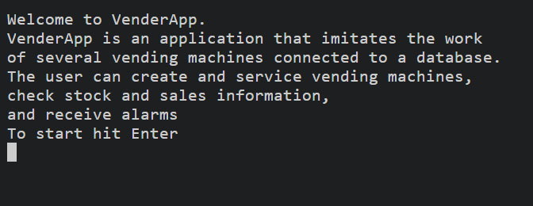

    

     
-   There are three main spreadsheets: VendingMachine,VendingSales, and Alarms. Each spreadsheet contains a template which the application use when creating a new vm.

    

    
Spread Sheets

    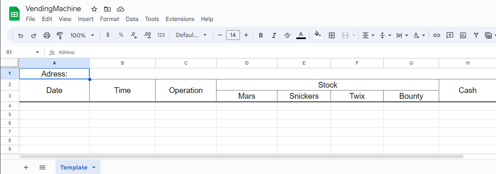
    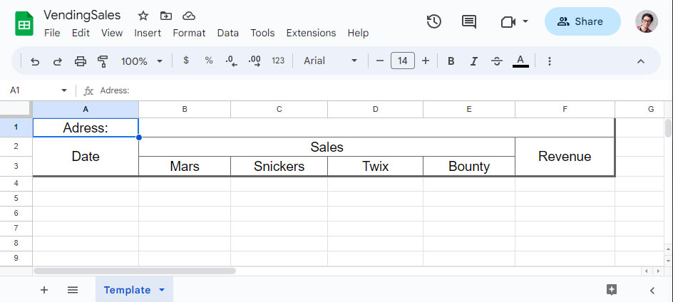
    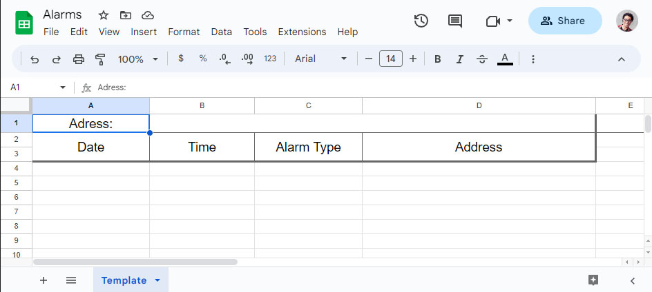

    
 
     
- When a new vm is created in each spreadsheet appears a new worksheet with a generated name, vm + number (vm01), the name is generated automatically and is validated for repetitions and always ordered. example - if we have three vms (vm01, vm02, vm03) and vm02 is deleted (vm01, vm03). Then the user wanted to add a new vm. the generated name will be (vm02) and not (vm04).

- The user always gets feed back on each operation including when errors occurs.
    

    
Feed Back

    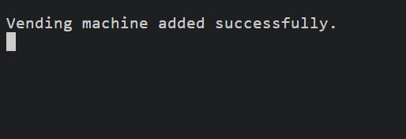

    

     
- Every user input is validated and the user gets feed back regarding the current operation.
    

    
User Validation

    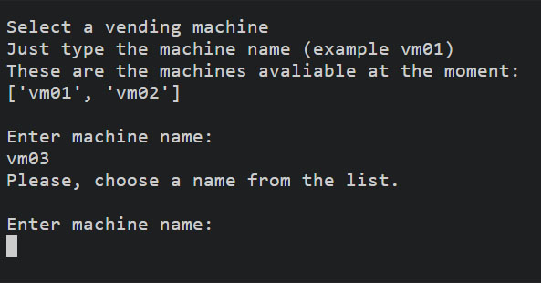

    

     
- On each operation the remaining stock, cash, and revenue is calculated separately and the database updates.
    
    - One item sold (mars):
        

        
One Item Sold

        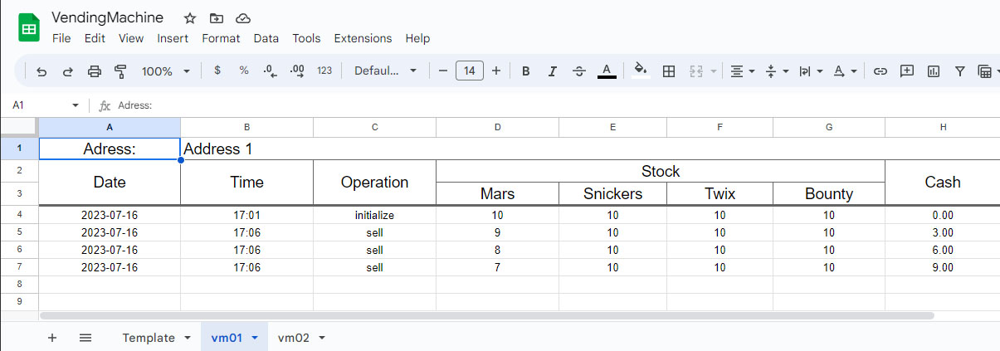
        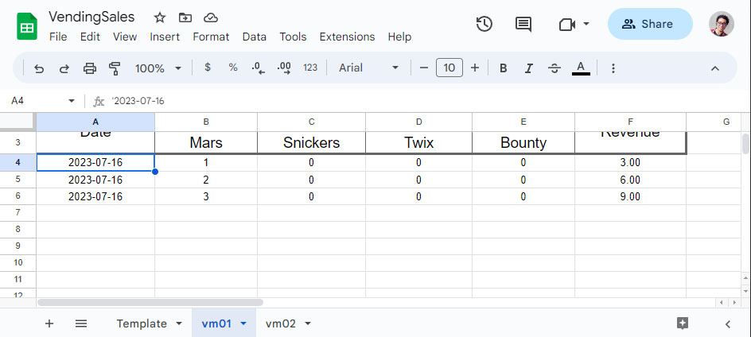
        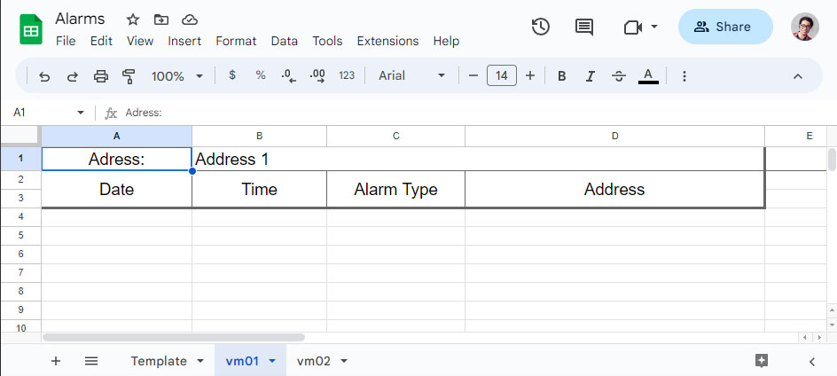

        
 
         
    - Stock near finish (5 items in stock): Alarm generated in the Alarms spread sheet.
        

        
Stock Near Finish

        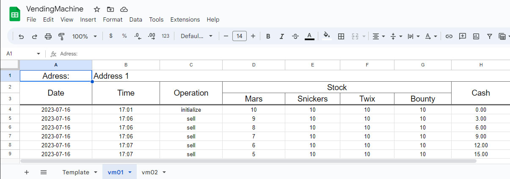
        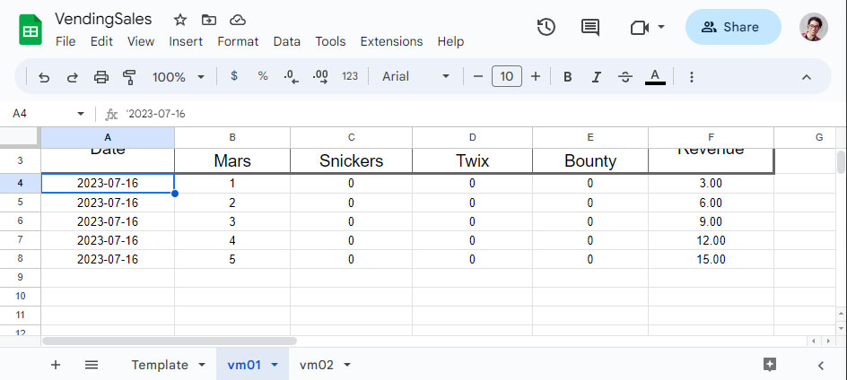
        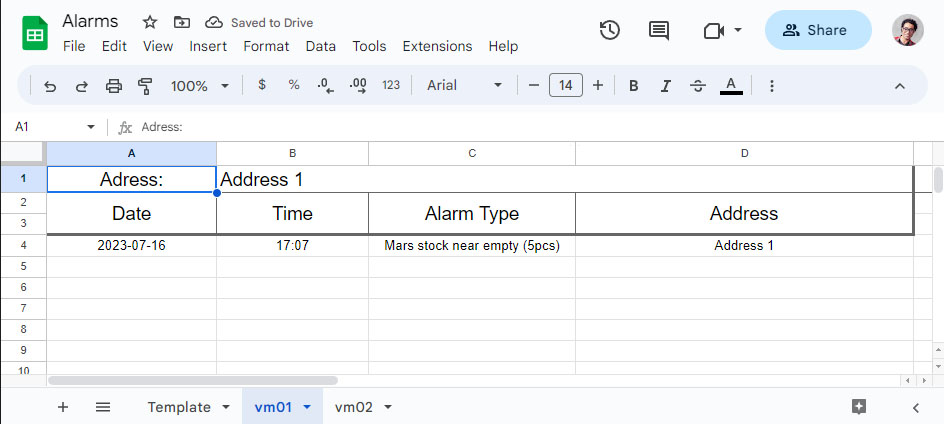

        
 
         
    - Stock finished (0 items in stock): Alarm generated in the Alarms spread sheet.
        

        
Stock Finished

        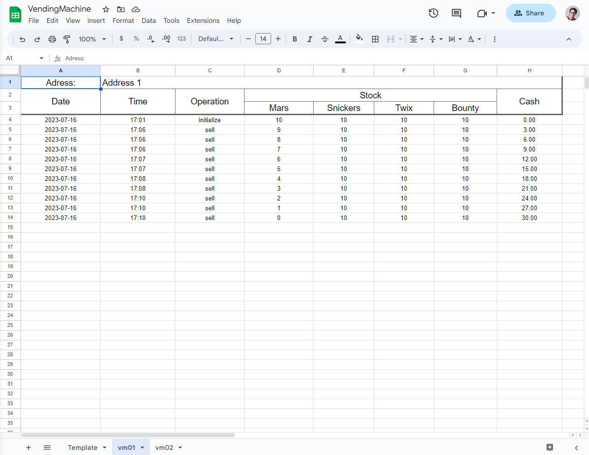
        
        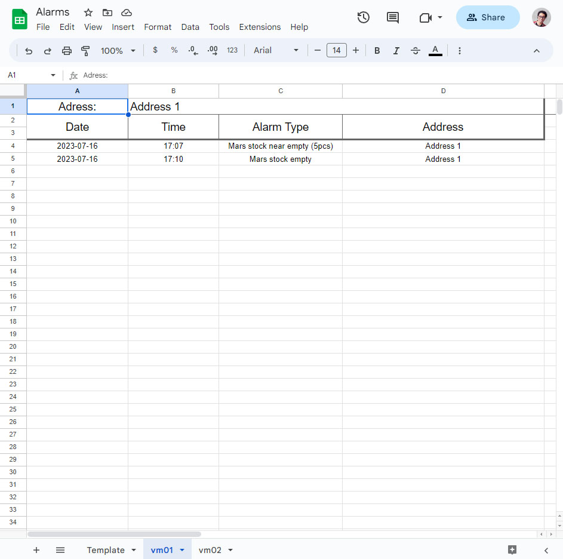

        
 
         
    - VM cashed:
        

        
Cashed

        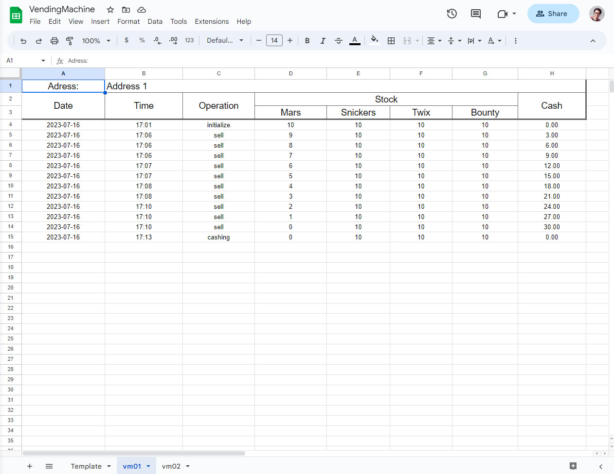
        
        

        
 
         
    - VM toped-up: All the alarms are deleted from the alarm spread sheet.
        

        
Toped-up

        
        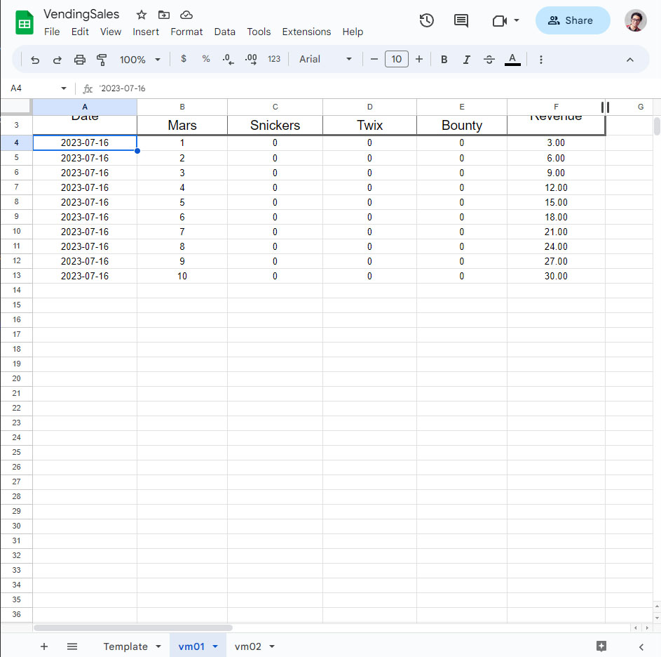
        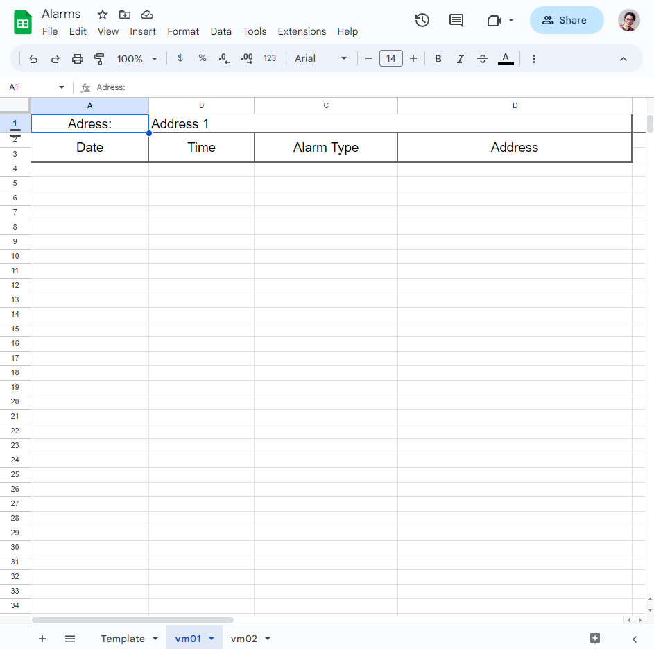

        
 
         
- User notification when out of stock or purchase is made.
    

    
User Notification

    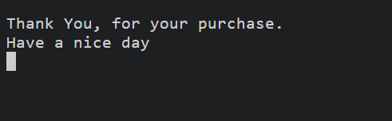
    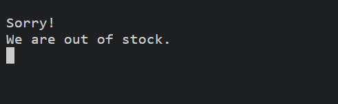

    

     
### **Future Features**
- The ability to show the user the date from the spread sheets to the user directly via the application.
- send The user an email when an alarm occurs.     

## **Data Model**
I decided to go with classes to separate the logic in to groups.
There are four classes:

- VM_Logic class: The logic behind the data and the database. 
- Admin class: The logic behind administrating vms. 
- Vending_Machine class: The logic behind the vm operations. 
- VM_UI class: The interactions with the user (user interface).

The processes of writing and retrieving data from API is handled fully by the VM_Logic class. The processes of calculating stock, sale, and revenue when choosing and purchasing an item or servicing the vm is handled by the Vending_Machine class. The processes of adding deleting vms is handled by the Admin class. And finally all the user interactions, menus and notifications is handles by the VM_UI class.    

## Technologies Used

 

### Languages Used

- Python

### Frameworks, Libraries & Programs Used

- Git - For version control.

- Heroku - For application deployment 

- [Github](https://github.com/) - To save and store the files for the website.

---

## Deployment & Local Development

### Deployment

This project was deployed using Code Institute's mock terminal for Heroku.
-   Fork or clone this repository
-   Create a new Heroku app
-   Set buildbacks to Python and NodeJS in that order
-   Link the Heroku app to the repository
-   Click on Deploy

#### How to Fork

How to Fork
To fork the VendingApp repository:

1. Log in (or sign up) to Github.
2. Go to the repository for this project, AhmadAlmasriDev/VendingApp.
3. Click the Fork button in the top right corner.

#### How to Clone

To clone the VendingApp repository:

1. Log in (or sign up) to GitHub.
2. Go to the repository for this project, AhmadAlmasriDev/VendingApp.
3. Click on the code button, select whether you would like to clone with HTTPS, SSH or GitHub CLI and copy the link shown.
4. Open the terminal in your code editor and change the current working directory to the location you want to use for the cloned directory.
5. Type 'git clone' into the terminal and then paste the link you copied in step 3. Press enter.

---

## Testing

 

- Please view [Testing.md](testing.md) for the testing documentation.

---

## Credits

 
### Code Used

- Most of the solutions to coding problems I encountered where taken from the [W3 School](https://www.w3schools.com/) and [Python website](https://www.python.org/) websites and off course [Stack over flow](https://stackoverflow.com/).

- Code related to API mostly used the official documentation [google sheets](https://developers.google.com/sheets/api/reference/rest) and [gspread](https://docs.gspread.org/en/v5.2.0/index.html)

- Some of the code used was inspired from the Code Institute python project LoveSandwiches like the use of zip in for loops.

###  Acknowledgments

A blueprint and an example for this README and testing files was provided by [kera-cudmore](https://github.com/kera-cudmore) from [code institute](https://codeinstitute.net/).
