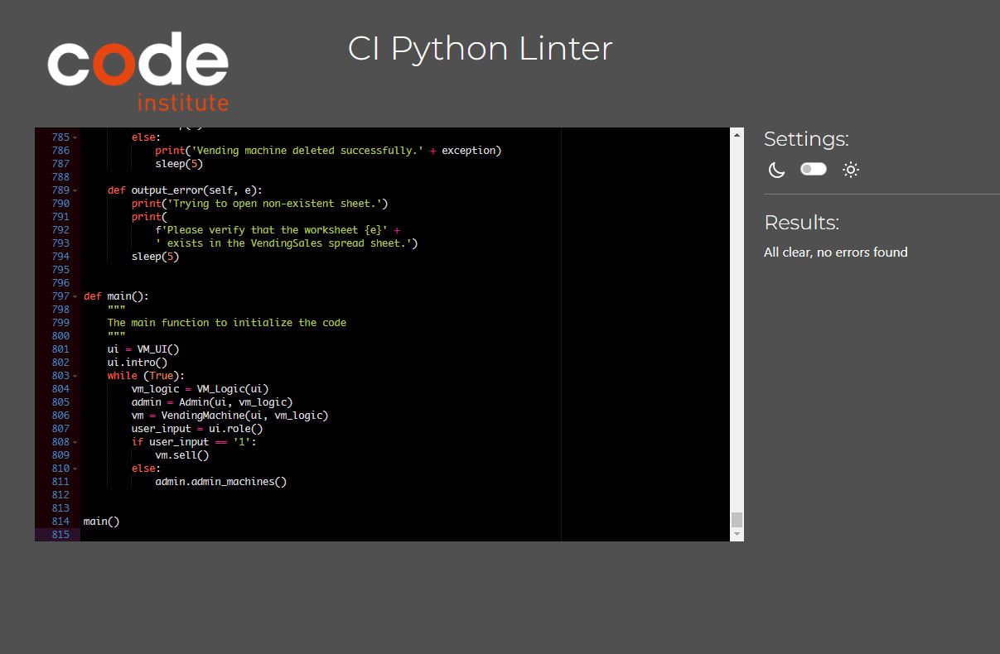

# Testing

[View VendingApp on Heroku](https://masvendingapp-017267977321.herokuapp.com/)

[View VendingMachine spreadsheet](https://docs.google.com/spreadsheets/d/1WgqyZJv61UsML8GGC8QygVm5rDc_4K5IeFve66Sfjp8/edit?usp=sharing)

[View VendingSales spreadsheet](https://docs.google.com/spreadsheets/d/1FbPbWOSGx6rh_AAkMYSMEWlBVr_n5EkIGA-fEFsz5J8/edit?usp=sharing)

[View Alarms spreadsheet](https://docs.google.com/spreadsheets/d/1JJfoOBQzP3t4PFv2pj6MkkTAolq6V9nA3o1Q2dzmgvU/edit?usp=sharing)

- - -

## CONTENTS

- [Testing](#testing)
  - [CONTENTS](#contents)
  - [AUTOMATED TESTING](#automated-testing)
    - [CI Python Linter Validator](#ci-python-linter-validator)
  - [MANUAL TESTING](#manual-testing)
    - [Testing User Stories](#testing-user-stories)
    - [Full Testing](#full-testing)
    - [Known Bugs](#known-bugs)
    - [Solved Bugs](#solved-bugs)

Testing was ongoing throughout the entire build, By individually testing each added function.

During development I made use of codeanywhere debugger to resolve bugs and non logical behavior.

I have also used  [CI Python Linter](https://pep8ci.herokuapp.com/)  Validator to check code for errors.
- - -

## AUTOMATED TESTING

### CI Python Linter Validator

  

  
Validator result

  

  

- - -

## MANUAL TESTING

### Testing User Stories

| Goals | How are they achieved? | Links & Images |
| :--- | :--- | :--- |
|To be able to create several vms.| By choosing the admin menu and add new vm.|[admin menu](documentation/menu-admin.jpg), [notification](documentation/feed-back-1.jpg).
|To be able to delete vms.| By choosing the admin menu and delete vm.| [admin menu](documentation/menu-admin.jpg), [notification](documentation/feed-back-4.jpg).
|To be able to choose specific vm.| By choosing one from available vms .| [choose vm](documentation/menu-select.jpg).
|To be able to buy from a vm.| By selecting a vm and select an item from vm menu.| [main menu](documentation/menu-main.jpg), [choose vm](documentation/menu-select.jpg), [vm menu](documentation/menu-vm.jpg), [notification](documentation/notification-1.jpg), [vm machine spread sheet](documentation/sale-one-machine.jpg).
|To be able to top-up a vm.| By choosing the maintenance menu from vm menu and then select topup| [vm menu](documentation/menu-vm.jpg), [maintenance menu](documentation/menu-maintenance.jpg), [notification](documentation/feed-back-3.jpg), [vm machine spread sheet](documentation/sale-topup-machine.jpg).
|To be able to cash a vm.| By choosing the maintenance menu from vm menu and then select cashing| [vm menu](documentation/menu-vm.jpg), [maintenance menu](documentation/menu-maintenance.jpg), [notification](documentation/feed-back-3.jpg).
|To provide the user with a way to check the stock on each vm.| By checking the VendingMachine spread sheet or via the app| [vm machine spread sheet](documentation/sale-almost-machine.jpg), [vm info](documentation/show-info.jpg).
|To provide the user with a way to check the alarms for each vm.| By checking the Alarms spread sheet or via the app| [alarm spread sheet](documentation/sale-empty-alarm.jpg), [alarm info](documentation/show-alarm.jpg).
|To provide the user with a way to check the sales and revenue for each vm.| By checking the VendingSales spread sheet or via the app| [sales spread sheet](documentation/sale-almost-sale.jpg), [sales info](documentation/show-sales.jpg).

### Full Testing

| Feature | Expected Outcome | Testing Performed | Result | Pass/Fail |
| --- | --- | --- | --- | --- |
| **START** |  |  |  |  |
|  |  |  |  |  |
| press enter | When pressed the main menu appears | pressed Enter | the main menu appeared | Pass|
| press other buttons | A prompt appears to press enter| press multi buttons | prompt appeared to press enter | Pass |
| **MAIN MENU** |  |  |  |  |
| press 1 (vm)| The vm menu appears | pressed 1 (vm) | the vm menu appeared | Pass|
| press 1 (vm) when no machines available | A notification no available machines appears | pressed 1 (vm) | A notification no available machines appeared | Pass|
| press 2 (Admin)| The Admin menu appears | pressed 2 (Admin) | The Admin menu appeared | Pass|
| press other buttons|  A prompt appears to press 1 or 2 | press multi buttons | A prompt appeared to press 1 or 2 | Pass|
| **SELECT VM MENU** |  |  |  |  |
| Enter machine name from list| The selected vm menu appears| Enter name from list |The selected vm menu appeared | Pass |
| Enter other machine name not from list| A prompt appears to enter a name from the list| Enter other name not from the list | A prompt appeared to enter a name from the list | Pass |
| **VM MENU** |  |  |  |  |
| Enter option 1 (Mars)| A notification of purchase appears, the main menu appears, the machine spread sheet updates with current stock and cash, the sales spread sheet updates with sales and revenue.| Enter option 1 (Mars) | A notification of purchase appeared, the main menu appeared, the machine spread sheet updated with current stock and cash, the sales spread sheet updated with sales and revenue| Pass |
| Enter option 1 (Mars) when stock is 6 pcs.| A notification of purchase appears, the main menu appears, the machine spread sheet updates with current stock and cash, the sales spread sheet updates with sales and revenue, an alarm "stock almost empty" appears in the alarms spread sheet.| Enter option 1 (Mars) |A notification of purchase appeared, the main menu appeared, the machine spread sheet updated with current stock and cash, the sales spread sheet updated with sales and revenue, an alarm "stock almost empty" appeared in the alarms spread sheet.| Pass |
| Enter option 1 (Mars) when stock is 1 pcs.| A notification of purchase appears, the main menu appears, the machine spread sheet updates with current stock and cash, the sales spread sheet updates with sales and revenue, an alarm "stock empty" appears in the alarms spread sheet.| Enter option 1 (Mars) |A notification of purchase appeared, the main menu appeared, the machine spread sheet updated with current stock and cash, the sales spread sheet updated with sales and revenue, an alarm "stock empty" appeared in the alarms spread sheet.| Pass |
| Enter option 1 (Mars) when stock is 0 pcs.| A notification of out of stock appears, the main menu appears.| Enter option 1 (Mars) |A notification of out of stock appears, the main menu appeared.| Pass |
| Enter option 2 (Snickers)| A notification of purchase appears, the main menu appears, the machine spread sheet updates with current stock and cash, the sales spread sheet updates with sales and revenue.| Enter option 2 (Snickers) | A notification of purchase appeared, the main menu appeared, the machine spread sheet updated with current stock and cash, the sales spread sheet updated with sales and revenue| Pass |
| Enter option 2 (Snickers) when stock is 6 pcs.| A notification of purchase appears, the main menu appears, the machine spread sheet updates with current stock and cash, the sales spread sheet updates with sales and revenue, an alarm "stock almost empty" appears in the alarms spread sheet.| Enter option 2 (Snickers) |A notification of purchase appeared, the main menu appeared, the machine spread sheet updated with current stock and cash, the sales spread sheet updated with sales and revenue, an alarm "stock almost empty" appeared in the alarms spread sheet.| Pass |
| Enter option 2 (Snickers) when stock is 1 pcs.| A notification of purchase appears, the main menu appears, the machine spread sheet updates with current stock and cash, the sales spread sheet updates with sales and revenue, an alarm "stock empty" appears in the alarms spread sheet.| Enter option 2 (Snickers) |A notification of purchase appeared, the main menu appeared, the machine spread sheet updated with current stock and cash, the sales spread sheet updated with sales and revenue, an alarm "stock empty" appeared in the alarms spread sheet.| Pass |
| Enter option 2 (Snickers) when stock is 0 pcs.| A notification of out of stock appears, the main menu appears.| Enter option 2 (Snickers) |A notification of out of stock appears, the main menu appeared.| Pass |
| Enter option 3 (Twix)| A notification of purchase appears, the main menu appears, the machine spread sheet updates with current stock and cash, the sales spread sheet updates with sales and revenue.| Enter option 3 (Twix) | A notification of purchase appeared, the main menu appeared, the machine spread sheet updated with current stock and cash, the sales spread sheet updated with sales and revenue| Pass |
| Enter option 3 (Twix) when stock is 6 pcs.| A notification of purchase appears, the main menu appears, the machine spread sheet updates with current stock and cash, the sales spread sheet updates with sales and revenue, an alarm "stock almost empty" appears in the alarms spread sheet.| Enter option 3 (Twix) |A notification of purchase appeared, the main menu appeared, the machine spread sheet updated with current stock and cash, the sales spread sheet updated with sales and revenue, an alarm "stock almost empty" appeared in the alarms spread sheet.| Pass |
| Enter option 3 (Twix) when stock is 1 pcs.| A notification of purchase appears, the main menu appears, the machine spread sheet updates with current stock and cash, the sales spread sheet updates with sales and revenue, an alarm "stock empty" appears in the alarms spread sheet.| Enter option 3 (Twix) |A notification of purchase appeared, the main menu appeared, the machine spread sheet updated with current stock and cash, the sales spread sheet updated with sales and revenue, an alarm "stock empty" appeared in the alarms spread sheet.| Pass |
| Enter option 3 (Twix) when stock is 0 pcs.| A notification of out of stock appears, the main menu appears.| Enter option 3 (Twix) |A notification of out of stock appears, the main menu appeared.| Pass |
| Enter option 4 (Bounty)| A notification of purchase appears, the main menu appears, the machine spread sheet updates with current stock and cash, the sales spread sheet updates with sales and revenue.| Enter option 4 (Bounty) | A notification of purchase appeared, the main menu appeared, the machine spread sheet updated with current stock and cash, the sales spread sheet updated with sales and revenue| Pass |
| Enter option 4 (Bounty) when stock is 6 pcs.| A notification of purchase appears, the main menu appears, the machine spread sheet updates with current stock and cash, the sales spread sheet updates with sales and revenue, an alarm "stock almost empty" appears in the alarms spread sheet.| Enter option 4 (Bounty) |A notification of purchase appeared, the main menu appeared, the machine spread sheet updated with current stock and cash, the sales spread sheet updated with sales and revenue, an alarm "stock almost empty" appeared in the alarms spread sheet.| Pass |
| Enter option 4 (Bounty) when stock is 1 pcs.| A notification of purchase appears, the main menu appears, the machine spread sheet updates with current stock and cash, the sales spread sheet updates with sales and revenue, an alarm "stock empty" appears in the alarms spread sheet.| Enter option 4 (Bounty) |A notification of purchase appeared, the main menu appeared, the machine spread sheet updated with current stock and cash, the sales spread sheet updated with sales and revenue, an alarm "stock empty" appeared in the alarms spread sheet.| Pass |
| Enter option 4 (Bounty) when stock is 0 pcs.| A notification of out of stock appears, the main menu appears.| Enter option 4 (Bounty) |A notification of out of stock appears, the main menu appeared.| Pass |
| Enter option 5 (Maintenance)| The Maintenance menu appears.| Enter option 5 (Maintenance) | The Maintenance menu appeared.| Pass |
| Enter option 6 (Exit)| A notification Back to main menu appears, The Main menu appears.| Enter option 6 (exit) | A notification Back to main menu appeared, The Main menu appeared.| Pass |
| Enter other option not from the list| A notification enter 1 -5 appears.| Enter other option not from the list | A notification enter 1 -5 appeared.| Pass |
| **MAINTENANCE MENU** |  |  |  |  |
| Enter option 1 (Topup)| All the stock quantities in the machine spread sheet updates to 10 pcs, deletes the alarms in the alarm spread sheet, a notification maintenance finished appears, the main menu appears.| Enter option 1 (Topup) | All the stock quantities in the machine spread sheet updated to 10 pcs, deleted the alarms in the alarm spread sheet, a notification maintenance finished appeared, the main menu appeared.| Pass |
| Enter option 2 (Cashing)| The cash amount in the machine spread sheet updates to 0, a notification maintenance finished appears, the main menu appears.| Enter option 2 (Cashing) | The cash amount in the machine spread sheet updated to 0, a notification maintenance finished appeared, the main menu appeared.| Pass |
| Enter option 3 (Exit)| A notification Back to main menu appears, The Main menu appears.| Enter option 3 (exit) | A notification Back to main menu appeared, The Main menu appeared.| Pass |
| Enter other option not in the list | A notification Enter 1 or 2 appears.| Enter other option not in the list | A notification Enter 1 or 2 appears.| Pass |
| **ADMIN MENU** |  |  |  |  |
| Enter option 1 (create vm) | A prompt input address appears. | Enter option 1 (create vm) | A prompt input address appears. | Pass |
| Enter address | A new vm spread sheet appears in the (machine, sales, alarms )work sheets, a notification created successfully appears, the main menu appears. | Enter address | A new vm spread sheet appeared in the (machine, sales, alarms) work sheets, a notification created successfully appeared, the main menu appeared. | Pass |
| Enter address while spread sheet name duplicate in one of the work sheets | Creates vm spread sheets until reach the duplicate, a notification created successfully with the error appears, the main menu appears. | Enter address | Created vm spread sheets until reach the duplicate, a notification created successfully with the error appeared, the main menu appeared. | Pass |
| Enter option 2 (delete vm) | A prompt select machine appears. | Enter option 2 (delete vm) | A prompt select machine appears. | Pass |
| Enter machine name from list| Deletes the selected vm spread sheet from the (machine, sales, alarms) work sheets,  notification deleted successfully appears, the main menu appears. | Enter name from list |Deleted the selected vm spread sheet from the (machine, sales, alarms) work sheets,  notification deleted successfully appeared, the main menu appeared. | Pass |
| Enter machine name from list while one of the vm spread sheets is duplicated or missing | Deletes the selected vm spread sheet from the (machine, sales, alarms) work sheets until encounters the duplicate,  notification deleted successfully appears with the error that occurred, the main menu appears. | Enter name from list | Deleted the selected vm spread sheet from the (machine, sales, alarms) work sheets until encountered the duplicate,  notification deleted successfully appeared with the error that occurred, the main menu appeared. | Pass |
| Enter option 3 (show vm info) | A prompt select machine appears. | Enter option 3 (show vm info) | A prompt select machine appeared. | Pass |
| Enter machine name from list| Info about this vm appears, a prompt to continue hit enter appears. | Enter name from list |Info about this vm appeared, a prompt to continue hit enter appeared. | Pass |
| Press enter| notification back to main menu appears, the main menu appears. | Enter name from list |notification back to main menu appeared, the main menu appeared. | Pass |
| Enter option 4 (show sales and revenue) | A prompt select machine appears. | Enter option 4 (show sales and revenue) | A prompt select machine appeared. | Pass |
| Enter machine name from list| Sales and revenue info about this vm appears, a prompt to continue hit enter appears. | Enter name from list |Sales and revenue info about this vm appeared, a prompt to continue hit enter appeared. | Pass |
| Press enter| notification back to main menu appears, the main menu appears. | Enter name from list |notification back to main menu appeared, the main menu appeared. | Pass |
| Enter option 5 (show alarms) | A prompt select machine appears. | Enter option 5 (show alarms) | A prompt select machine appeared. | Pass |
| Enter machine name from list| Alarms for this vm appears, a prompt to continue hit enter appears. | Enter name from list | Alarms for this vm appeared, a prompt to continue hit enter appeared. | Pass |
| Press enter| notification back to main menu appears, the main menu appears. | Enter name from list |notification back to main menu appeared, the main menu appeared. | Pass |
| Enter option 6 (exit) | A notification back to main menu appears, the main menu appears. | Enter option 6 (exit) | A notification back to main menu appeared, the main menu appeared. | Pass |
| Enter other machine name not from list| A prompt appears to enter a name from the list| Enter other name not from the list | A prompt appeared to enter a name from the list | Pass |

---

### Known Bugs

| Known Bug No | Bug Issue | Plan to Resolve |
| :--- | :--- | :--- |
| 1 | The application stops if one of the spread sheets is not online because the constants for the spread sheets is declared before any try: block. There is a way to wrap the constants in a try: block but I think it is an overkill and there must be some elegant way to do it.  | try another way to declare the spread sheets names may be not constants|

### Solved Bugs

| Bug No | Bug Issue | How Resolved |
| :--- | :--- | :--- |
| 1 | Used match case in parts of the code, and it did not work.  After checking the python version on codeanywhere found that it was not up to date.| Rewrote the code with if elif blocks|
| 2 | when entering space in a user input the application stops | all the user input is validated |
| 3 | when topping-up and the alarms spread sheet is empty it gives an error | added code that verifies if the spread sheet is empty |
| 4 | updating the address cell always gives a warning of a deprecated function even though it is from there official page | changed the function name to a one found on stackoverflow |

Back to [README.md](README.md)